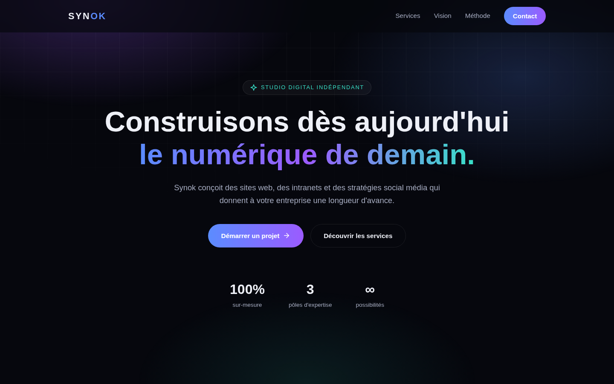

# Portfolio Synok — synok.fr

Portfolio professionnel de Synok : sites web, intranets et social média.

## Aperçu



| Page complète (1440 px) | Mobile (375 px) |
|---|---|
| [`screenshots/page-complete.png`](screenshots/page-complete.png) | [`screenshots/mobile-375.png`](screenshots/mobile-375.png) |

## Structure

- `index.html` — page unique du portfolio (hero, services, vision, méthode, contact)
- `style.css` — design system (tokens CSS, thème sombre Aurora/Glassmorphism, micro-interactions, responsive)
- `script.js` — interactions (menu mobile, header au scroll, lien actif, animations au scroll)

## Principes UI/UX appliqués

Refonte basée sur les bonnes pratiques du skill [UI/UX Pro Max](https://github.com/nextlevelbuilder/ui-ux-pro-max-skill) :

- Icônes SVG (style Lucide) — aucun emoji ni glyphe unicode en guise d'icône
- États de survol avec transitions fluides (150-300 ms)
- États de focus visibles pour la navigation clavier (`:focus-visible`) + lien d'évitement
- `cursor: pointer` sur tous les éléments cliquables
- `prefers-reduced-motion` respecté
- Responsive testé : 375 px, 768 px, 1024 px, 1440 px
- Design tokens centralisés (couleurs, rayons, transitions)

## Lancer en local

Ouvrir `index.html` dans un navigateur, ou servir le dossier :

```bash
python3 -m http.server 8000
```
